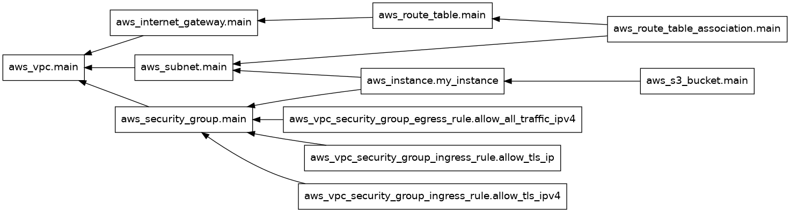

# Terraform AWS Infrastructure

Provisions a complete AWS network and compute setup using Terraform IaC.

## Infrastructure Overview



## Resources Provisioned

- **VPC** with custom CIDR block
- **Public Subnet** within the VPC
- **Internet Gateway** attached to VPC
- **Route Table** with public route + subnet association
- **Security Group** with TLS ingress rules (IPv4/IPv6) and all-traffic egress
- **EC2 Instance** deployed inside the subnet
- **S3 Bucket** for storage

## Usage

```bash
terraform init
terraform plan
terraform apply
terraform destroy
```

## Files

| File | Purpose |
|------|---------|
| `main.tf` | All resource definitions |
| `providers.tf` | AWS provider configuration |
| `graph.png` | Terraform resource dependency graph |
